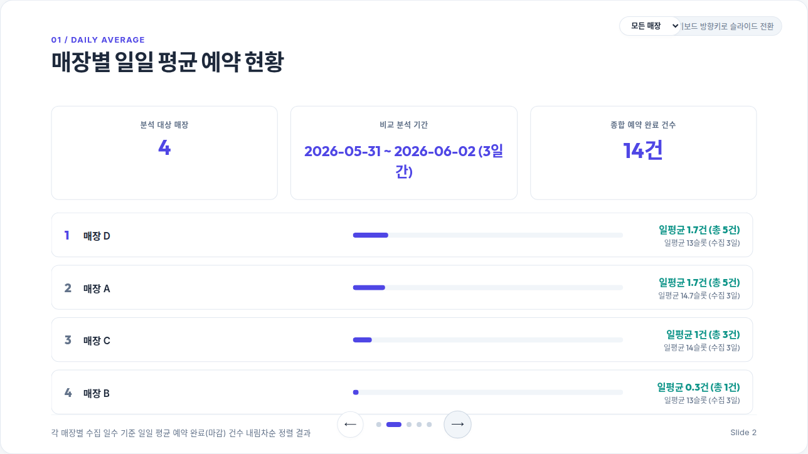

# Nmap Reservation Analyzer 한국어 설명서

이 프로젝트는 네이버 지도 예약 시스템의 데이터를 로컬 환경에서 수집하고 분석할 수 있는 도구입니다. 헤드리스 브라우저 자동화를 사용하여 예약 가능 시간 데이터를 수집하며, 브라우저 기반 대시보드를 통해 수집 결과를 시각화합니다.

## 대시보드 화면 예시



## 작동 원리

이 시스템은 두 가지의 단계로 구성되어 실행됩니다.

- 데이터 수집 단계 (Phase 1)
  
  `src/collect.js` 스크립트를 통해 Puppeteer로 헤드리스 Chromium 브라우저를 실행하여 네이버 예약 페이지로 이동함. 페이지에서 발생하는 GraphQL API 통신을 감지하고 시간대별 예약 데이터를 추출하여 `data/` 디렉토리에 CSV 형식의 파일로 저장함.

- 데이터 시각화 단계 (Phase 2)
  
  `dashboard/report.html` 파일은 단일 파일로 구성된 대시보드 화면임. 로컬 웹 서버를 실행한 뒤 수집된 CSV 파일을 브라우저 화면에 드래그 앤 드롭 방식으로 업로드하여 데이터를 파싱하고 차트로 시각화함.

## 프로젝트 구조

```
.
├── config/
│   ├── config.json       # targetDays, outputPath 설정
│   └── studios.json      # 대상 매장의 bizId 및 resourceId 목록
├── data/                 # 수집된 CSV 파일 저장 디렉토리
├── dashboard/
│   └── report.html       # 대시보드 페이지 파일
├── src/
│   ├── collect.js        # 데이터 수집 스크립트
│   └── add_studio.js     # 매장 추가 등록 유틸리티
├── package.json
└── README.ko.md
```

## 설치 및 설정

의존성 패키지를 설치합니다.

```bash
npm install
```

`config/studios.json` 파일에 수집 대상 매장의 정보를 설정합니다. 각 매장은 `bizId` 정보를 필수적으로 포함해야 합니다. `resourceId`가 생략된 경우 수집기가 대상 페이지의 Apollo 상태를 분석하여 자동으로 감지합니다.

## 매장 추가 등록

수집 대상 매장을 추가하기 위해 자동 등록 유틸리티를 활용할 수 있습니다. 네이버 플레이스 상세 페이지 URL 또는 네이버 예약 URL을 인자값으로 전달하여 실행하면 `config/studios.json` 파일에 해당 매장 정보가 자동으로 저장됩니다.

```bash
npm run add "<네이버 플레이스 또는 예약 URL>"
```

예시:

```bash
npm run add "https://m.place.naver.com/place/12345678"
```

## 사용 방법

예약 데이터를 수집합니다.

```bash
npm start
```

수집이 완료되면 `data/reservations_YYYYMMDD.csv` 경로에 결과 파일이 생성됩니다.

대시보드를 실행합니다. 별도의 웹 서버 구동 없이 `dashboard/report.html` 파일을 브라우저로 직접 열어 실행할 수 있습니다. 파일 탐색기에서 `dashboard/report.html` 파일을 직접 더블클릭하거나 브라우저 주소창에 파일 경로를 직접 입력하여 접속합니다.

대안으로 로컬 웹 서버를 구동하여 접속할 수도 있습니다.

```bash
python3 -m http.server 8000
```

웹 서버 구동 시 브라우저에서 `http://localhost:8000/dashboard/report.html` 주소로 접속합니다. 대시보드의 파일 업로드 영역에 수집된 CSV 파일을 드래그 앤 드롭하여 데이터를 분석합니다.

## 크론 탭 자동화

주기적으로 수집을 진행하기 위해 크론 탭 설정을 활용할 수 있습니다. 매일 오전 8시에 데이터를 수집하는 예시는 다음과 같습니다.

```text
0 23 * * * cd /path/to/navermap && npm start >> data/cron.log 2>&1
```

## 주의 사항

- 대시보드는 브라우저 환경에서만 동작하며 외부로 데이터를 전송하지 않음.
- 로컬 파일 경로(`file://`) 환경에서도 데이터 드래그 앤 드롭 및 차트 분석 기능이 정상적으로 동작함.
- 여러 날짜의 CSV 파일을 동시에 선택하여 업로드하면 통합 분석이 가능함.
